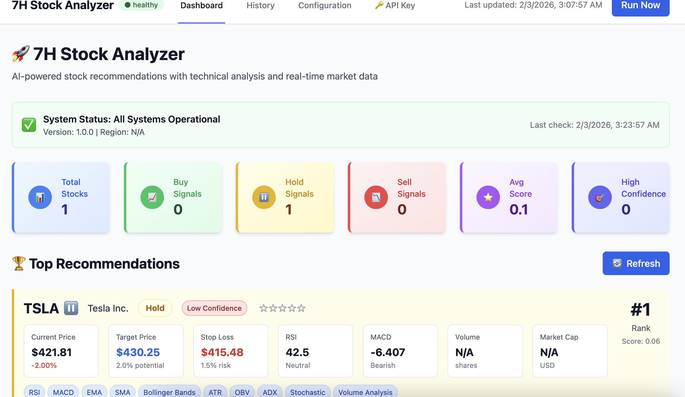

# 📈 7H Stock Analyzer



A Python application that provides AI-powered stock recommendations based on technical analysis parameters. The system analyzes multiple technical indicators including RSI, MACD, Moving Averages, Bollinger Bands, and more to generate buy/sell/hold recommendations.

## Features

- **Technical Indicators Analysis:**
  - RSI (Relative Strength Index)
  - MACD (Moving Average Convergence Divergence)
  - Simple Moving Averages (SMA 20, 50, 200)
  - Exponential Moving Averages (EMA 12, 26)
  - Bollinger Bands
  - Stochastic Oscillator
  - Average True Range (ATR)
  - On-Balance Volume (OBV)

- **Recommendation Engine:**
  - Generates BUY/SELL/HOLD recommendations based on multiple indicators
  - Scoring system that weighs different technical signals
  - Detailed reasoning for each recommendation

- **Multiple Analysis Modes:**
  - Single stock analysis
  - Portfolio analysis with top BUY/SELL recommendations
  - **Beautiful web interface** with real-time analysis

## Installation

1. **Navigate to the project directory:**
   ```bash
   cd ~/workspace/7H-tech-analyse
   ```

2. **Create a virtual environment (recommended):**
   ```bash
   python3 -m venv venv
   source venv/bin/activate  # On Windows: venv\Scripts\activate
   ```

3. **Install dependencies:**
   ```bash
   pip install -r requirements.txt
   ```

## Quick Start

### 🚀 Start the Web Application

1. **Start the Flask server:**
   ```bash
   lsof -ti:80 | xargs kill
   python3 app.py
   ```

2. **Open your browser** and navigate to:
   ```
   http://localhost:80
   ```

3. **Stop the server:** Press `Ctrl+C` in the terminal

### 📊 Using the Web Interface

#### Single Stock Analysis

1. Click on the **"Single Stock"** tab
2. Enter a stock symbol (e.g., `AAPL`, `MSFT`, `GOOGL`)
3. Select a time period (default: 1 Year)
4. Click **"Analyze Stock"**
5. View detailed technical indicators and recommendations

#### Portfolio Analysis

1. Click on the **"Portfolio"** tab
2. Enter multiple stock symbols (comma or space separated):
   ```
   AAPL, MSFT, GOOGL, TSLA, NVDA, AMZN, META, NFLX
   ```
3. Select time period and number of top recommendations
4. Click **"Analyze Portfolio"**
5. View:
   - **Top BUY Recommendations** (sorted by score)
   - **Top SELL Recommendations** (sorted by score)
   - Portfolio summary statistics

#### Import Portfolio from Brokerage

1. Click on the **"Import Portfolio"** tab
2. Export your portfolio as CSV from your brokerage:
   - **Robinhood**: Export from Account → History → Export
   - **E-Trade**: Export from Portfolio → Positions → Export
   - **Other brokerages**: Use generic CSV format
3. Upload the CSV file
4. Select brokerage or choose "Auto-detect"
5. Check "Save symbols to portfolio configuration" to update your portfolio
6. Click **"Import Portfolio"**
7. View imported holdings with:
   - Total portfolio value and P&L
   - Individual holding details
   - Performance metrics

### 💾 Persistent Data Storage

The portfolio import system now includes persistent storage to keep your data available across Flask app restarts:

#### **How It Works**
- Imported portfolio data is saved to `input/portfolio_data.json`
- A human-readable CSV backup is created at `input/imported_portfolio.csv`
- Data persists even when the Flask app restarts
- Storage info includes import date, broker, and holdings count

#### **Storage Options**
- **Save portfolio data for persistence** (checked by default)
  - Stores complete portfolio data with quantities and prices
  - Enables portfolio summary and analysis features
  - Survives app restarts and server reboots
  
- **Save symbols to portfolio configuration** (optional)
  - Updates `input/config_portfolio.txt` with symbol list
  - Enables technical analysis on imported symbols
  - Compatible with existing portfolio analysis workflow

#### **Storage Files**
```
input/
├── portfolio_data.json       # Primary storage (JSON format)
├── imported_portfolio.csv   # Human-readable backup
└── config_portfolio.txt     # Symbol list for analysis
```

#### **API Endpoints for Storage**
- `GET /api/portfolio_data` - Retrieve stored portfolio
- `DELETE /api/portfolio_data` - Clear stored data
- `POST /api/portfolio_config` - Update config from storage
- `GET /api/portfolio_summary` - Portfolio summary with storage info

### 📋 Supported CSV Formats

#### Robinhood Format
```csv
symbol,quantity,average_buy_price,current_price,equity,gain_loss,gain_loss_pct
AAPL,10,150.00,165.50,1655.00,155.00,10.33
MSFT,5,250.00,280.75,1403.75,153.75,12.30
```

#### E-Trade Format
```csv
Symbol,Quantity,Price,Value,Cost Basis,Unrealized Gain/Loss
AAPL,10,165.50,1655.00,1500.00,155.00
MSFT,5,280.75,1403.75,1250.00,153.75
```

#### Generic CSV Format
```csv
Symbol,Quantity,Average Cost,Last Price
AAPL,10,150.00,165.50
MSFT,5,250.00,280.75
```

### 🎨 Web App Features

- **Beautiful Modern UI**: Gradient background, smooth animations
- **Real-time Analysis**: Results appear instantly via AJAX
- **Responsive Design**: Works on desktop, tablet, and mobile
- **Color-coded Recommendations**: 
  - 🟢 Green for BUY
  - 🔴 Red for SELL
  - 🟡 Yellow for HOLD
- **Detailed Indicators**: RSI, MACD, Moving Averages, Bollinger Bands
- **Portfolio Insights**: Compare multiple stocks at once

## Recommendation Scoring System

The recommendation engine uses a scoring system:

- **Score ≥ 5:** STRONG BUY
- **Score 2-4:** BUY
- **Score -1 to 1:** HOLD
- **Score -4 to -2:** SELL
- **Score ≤ -5:** STRONG SELL

### Scoring Factors

- **RSI:** +2 (oversold), -2 (overbought), +1 (neutral-bullish), -1 (neutral-bearish)
- **MACD:** +2 (bullish crossover), -2 (bearish crossover)
- **Moving Averages:** +1 per MA above price, -2 if below all MAs
- **Golden/Death Cross:** +1 (golden), -1 (death)
- **Bollinger Bands:** +1 (near lower), -1 (near upper)
- **Stochastic:** +1 (oversold), -1 (overbought)
- **Price Momentum:** +1 (strong positive), -1 (strong negative)

## Project Structure

```
7H-Stock-Analyzer/
├── app.py               # Flask web application
├── core/                # Core analysis engine
│   ├── stock_analyzer.py
│   ├── portfolio_forklift.py  # Portfolio import module
│   └── portfolio_storage.py  # Persistent data storage
├── requirements.txt     # Python dependencies
├── input/               # Configuration and data files
│   ├── config_portfolio.txt
│   ├── config_watchlist.txt
│   ├── config_us_stocks.txt
│   ├── config_etfs.txt
│   ├── portfolio_data.json     # Persistent portfolio storage
│   └── imported_portfolio.csv  # CSV backup
├── assets/              # Combined static files and templates
│   ├── css/
│   │   └── style.css
│   ├── js/
│   │   └── main.js
│   ├── base.html
│   └── index.html
├── tests/               # Test suite
│   ├── test_stock_analyzer.py
│   ├── test_flask_app.py
│   ├── test_recommendation_engine.py
│   ├── test_integration.py
│   └── test_portfolio_forklift.py  # Portfolio import tests
├── temp/                # Temporary file uploads
├── robinhood_export_guide.py    # Robinhood export instructions
├── doc/
│   └── readme.png      # Branding image
└── README.md           # This file
```

## Dependencies

- **yfinance:** Yahoo Finance data fetching
- **pandas:** Data manipulation
- **numpy:** Numerical operations
- **ta:** Technical analysis library
- **flask:** Web framework for browser interface

## Important Notes

⚠️ **Disclaimer:** This tool is for educational and informational purposes only. Stock recommendations are based solely on technical analysis and should not be considered as financial advice. Always do your own research and consult with a financial advisor before making investment decisions.

- Stock data is fetched from Yahoo Finance (free, but may have rate limits)
- Requires internet connection
- Historical data availability depends on the stock exchange
- Technical analysis is just one aspect of stock evaluation

## Tips

- Use the portfolio analysis for comparing multiple stocks
- Higher scores = Better BUY opportunities
- Lower (negative) scores = Consider SELL
- Check the reasoning for each recommendation

## Troubleshooting

**Issue:** "No data found for [SYMBOL]"
- Verify the stock symbol is correct
- Check if the stock is listed on a supported exchange
- Ensure you have an internet connection

**Issue:** "Limited data" warning
- Try selecting a shorter period in the web interface
- Some stocks may have limited trading history

**Issue:** Import errors
- Make sure all dependencies are installed: `pip install -r requirements.txt`
- Ensure you're using Python 3.7 or higher

**Issue:** Flask app won't start
- Check if port 80 is already in use (the app uses port 80)
- Try: `python3 app.py` (not `python app.py`)
- Ensure Flask is installed: `pip install flask`
- On macOS/Linux, you may need to use `sudo` to run on port 80, or change the port in `app.py` to 5000

## Testing

### 🧪 Run Test Suite
```bash
# Install all dependencies (includes testing)
pip install -r requirements.txt

# Run all tests
pytest

# Run with verbose output
pytest -v

# Run specific test categories
pytest tests/test_stock_analyzer.py -v  # Core functionality
pytest tests/test_flask_app.py -v       # Web application
pytest tests/test_recommendation_engine.py -v  # Recommendation logic
pytest tests/test_integration.py -v         # Integration tests
```

### 📋 Test Coverage

#### **Core Functionality** (`test_stock_analyzer.py`)
- ✅ StockAnalyzer initialization
- ✅ Technical indicators calculation (RSI, MACD, SMA, EMA, Bollinger Bands)
- ✅ Fundamental indicators fetching (P/E, market cap, dividend yield)
- ✅ Error handling for invalid symbols
- ✅ Edge cases and data validation

#### **Web Application** (`test_flask_app.py`)
- ✅ Page loading (Portfolio, Watchlist, Market, ETF)
- ✅ API endpoints (`/api/config_stocks`, `/analyze_portfolio`, `/analyze_market`, `/analyze_etf`)
- ✅ Form validation and submission
- ✅ Error handling for malformed requests
- ✅ Static file serving (CSS, JavaScript)
- ✅ Invalid endpoint handling (404 errors)

#### **Recommendation Engine** (`test_recommendation_engine.py`)
- ✅ STRONG BUY conditions (oversold RSI, bullish MACD, golden cross)
- ✅ STRONG SELL conditions (overbought RSI, bearish MACD, death cross)
- ✅ HOLD recommendations (neutral indicators)
- ✅ RSI extreme values (very oversold/overbought)
- ✅ Golden/Death cross detection
- ✅ Bollinger Bands signals (price near upper/lower bands)
- ✅ MACD signal interpretation
- ✅ Reasoning quality and explanations

#### **Integration Tests** (`test_integration.py`)
- ✅ Configuration file loading (portfolio, watchlist, ETF, US stocks)
- ✅ Requirements file validation
- ✅ Template file existence and content
- ✅ Static file availability
- ✅ Project structure integrity

### 🎯 Critical Functionality Protected

These tests ensure that core functionality remains intact during development:

**🔧 Analysis Engine**: StockAnalyzer class, indicator calculations, recommendation generation
**🌐 Web Interface**: All pages load, APIs respond, forms work
**📊 Decision Logic**: Buy/sell/hold recommendations are accurate
**🔗 Integration**: Configuration files, templates, static assets function properly

### 🚀 Before Deployment

Always run these tests before deploying changes:
```bash
# Clear pytest cache (if test discovery issues occur)
rm -rf .pytest_cache

# Full test suite (recommended)
pytest tests/ -v

# Quick critical tests (faster)
pytest tests/test_stock_analyzer.py tests/test_flask_app.py -v
```

### 🔧 Troubleshooting Test Issues

If pytest can't discover tests, try:
```bash
# Clear pytest cache
rm -rf .pytest_cache

# Run specific test
python -m pytest tests/test_integration.py::TestIntegration::test_static_files_exist -v
```

## 🚨 Automated Alerts (Pushover)

The app can send **iPhone notifications** via Pushover when new BUY signals are detected for your portfolio or ETFs.

### Setup

1. **Copy the example environment file:**
   ```bash
   cp .env.example .env
   ```

2. **Edit `.env` with your Pushover credentials:**
   ```env
   ALERTS_ENABLE=true
   PUSHOVER_APP_TOKEN=your_app_token_here
   PUSHOVER_USER_KEY=your_user_key_here
   ```

   - Get your tokens from [Pushover.net](https://pushover.net/)
   - `PUSHOVER_APP_TOKEN`: Create an app on Pushover
   - `PUSHOVER_USER_KEY`: Your user key on Pushover

3. **Optional: Customize alert behavior** (see `.env.example` for all options):
   ```bash
   # Minimum score for alerts (default: 3)
   ALERT_MARKET_MIN_SCORE=3
   ALERT_ETF_MIN_SCORE=3

   # Portfolio-only market alerts (default: true)
   ALERT_MARKET_PORTFOLIO_ONLY=true

   # How many top results to consider (default: 10)
   ALERT_MARKET_TOP_N=10
   ALERT_ETF_TOP_N=10

   # ETF daily run time (default: 08:00)
   ALERT_ETF_RUN_HOUR=8
   ALERT_ETF_RUN_MINUTE=0
   ```

   **Full `.env.example` for reference:**
   ```bash
   # Alert Configuration
   # Copy this file to .env and fill in your Pushover credentials
   # Required for iPhone notifications via Pushover

   ALERTS_ENABLE=true
   PUSHOVER_APP_TOKEN=your_app_token_here
   PUSHOVER_USER_KEY=your_user_key_here

   # Optional: customize thresholds and behavior
   ALERT_API_BASE_URL=http://127.0.0.1:80
   ALERT_MARKET_MIN_SCORE=3
   ALERT_MARKET_PORTFOLIO_ONLY=true
   ALERT_MARKET_TOP_N=10
   ALERT_MARKET_PERIOD=1y

   ALERT_ETF_ENABLED=true
   ALERT_ETF_MIN_SCORE=3
   ALERT_ETF_TOP_N=10
   ALERT_ETF_PERIOD=1y
   ALERT_ETF_RUN_HOUR=8
   ALERT_ETF_RUN_MINUTE=0

   # Optional: log to file (defaults to /tmp/)
   # ALERT_LOG_FILE=/path/to/alerts.log
   ```

4. **Restart the Flask app** to enable alerts.

### How It Works

- **Market alerts**: Run every hour during US market hours (9:30 AM–4:00 PM ET)
  - Only BUY signals with score ≥ 3
  - Filters to symbols in your portfolio (`input/config_portfolio.txt`)
  - Sends notification for *new* signals only (deduped)

- **ETF alerts**: Run daily at 8:00 AM local time
  - Only BUY signals with score ≥ 3
  - Sends notification for *new* ETF signals only

### Optional Customization

Add to `.env` to tune behavior:

```env
# Minimum score for alerts (default: 3)
ALERT_MARKET_MIN_SCORE=3
ALERT_ETF_MIN_SCORE=3

# Portfolio-only market alerts (default: true)
ALERT_MARKET_PORTFOLIO_ONLY=true

# How many top results to consider (default: 10)
ALERT_MARKET_TOP_N=10
ALERT_ETF_TOP_N=10

# ETF daily run time (default: 08:00)
ALERT_ETF_RUN_HOUR=8
ALERT_ETF_RUN_MINUTE=0

# Optional: log alerts to a file
ALERT_LOG_FILE=/path/to/alerts.log
```

### State & Deduplication

- Alert state is stored in `input/.alerts_state.json` (auto-created)
- Only *new* signals trigger notifications
- State persists across app restarts

## Future Enhancements

Potential features to add:
- Support for more technical indicators
- Backtesting capabilities
- Email/SMS alerts
- Database storage for historical analysis
- Integration with trading APIs
- Chart visualizations
- Export results to CSV/PDF

## License

This project is provided as-is for educational purposes.

## Contributing

Feel free to fork, modify, and improve this project according to your needs!
